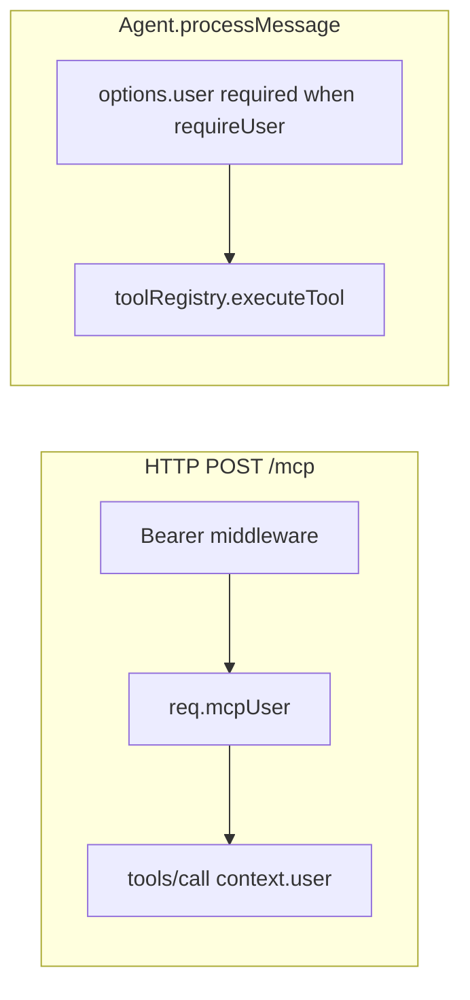

# MCP OAuth Authentication

Optional GitHub and/or Google SSO for ExpressMcp. Users receive a JWT after login; MCP clients send `Authorization: Bearer <token>` on each request.

## Quick start (plug-and-play)

```javascript
import express from 'express';
import { ExpressMcp } from '@brandon-svec/express_mcp';

const expressMcp = new ExpressMcp({
  name: 'my-service',
  auth: {
    enabled: true,
    baseUrl: 'https://my-host.example.com',
    callbackUrl: 'https://my-host.example.com/mcp/auth/callback',
    jwtSecret: process.env.JWT_SECRET,
    sessionSecret: process.env.SESSION_SECRET,
    jwtExpiresIn: '7d',
    allowedUsers: [],
    providers: {
      google: { clientId: '...', clientSecret: '...' }
    }
  }
});

const app = express();
app.use(express.json());
app.use(expressMcp.httpRouter()); // OAuth + MCP on one router
app.listen(3000);
```

`ExpressMcp` normalizes auth config via `buildAuthOptions()` in the constructor. Pass `baseUrl` and `providers`; the library derives `issuer` and validates required fields.

## Auth config reference

| Field | Required when `enabled: true` | Description |
|-------|-------------------------------|-------------|
| `enabled` | — | `false` disables auth; other fields are not validated |
| `baseUrl` | Yes (unless `issuer` set) | Public origin, no trailing slash; library sets `issuer = baseUrl + resourcePath` |
| `callbackUrl` | Yes | Must match OAuth app redirect URI exactly |
| `jwtSecret` | Yes | Signs MCP Bearer JWTs |
| `sessionSecret` | Yes | express-session secret for OAuth handshake only |
| `jwtExpiresIn` | Yes | JWT lifetime (e.g. `7d`, `1h`) |
| `allowedUsers` | No | Email/login allowlist; omit or `[]` = any authenticated user |
| `providers` | Yes | Map of `github` / `google` with `clientId` + `clientSecret` |
| `resourcePath` | No | Default `/mcp`; mount path for MCP + OAuth metadata |
| `loginStateExpiresIn` | No | TTL for pending standalone login sessions (default `10m`) |
| `onTokenIssued` | No | `async (user, jwt, context) => {}` after standalone OAuth (not MCP PKCE) |
| `postLoginRedirectUrl` | No | Browser redirect after standalone OAuth (e.g. `https://t.me/YourBot`) |
| `sessionStore` | No | `InMemoryStandaloneSessionStore` or `RedisStandaloneSessionStore` — pending + active standalone sessions |

### Derived values (normally do not set manually)

- `issuer` = `{baseUrl}{resourcePath}` (e.g. `https://host/mcp`)
- Default `callbackUrl` pattern: `{baseUrl}/mcp/auth/callback`

### Single-provider shorthand (backward compatible)

```javascript
auth: {
  enabled: true,
  baseUrl: 'http://localhost:3000',
  callbackUrl: 'http://localhost:3000/mcp/auth/callback',
  jwtSecret: '...',
  sessionSecret: '...',
  jwtExpiresIn: '7d',
  provider: 'github',
  clientId: '...',
  clientSecret: '...'
}
```

## Environment variables

For apps without a config module, use `buildAuthOptionsFromEnv()`:

```javascript
import { buildAuthOptionsFromEnv, ExpressMcp } from '@brandon-svec/express_mcp';

const auth = buildAuthOptionsFromEnv({ baseUrl: 'http://localhost:3000' });
if (auth) {
  const expressMcp = new ExpressMcp({ name: 'my-service', auth });
}
```

| Env var | Maps to |
|---------|---------|
| `GITHUB_CLIENT_ID` / `GITHUB_CLIENT_SECRET` | `providers.github` |
| `GOOGLE_CLIENT_ID` / `GOOGLE_CLIENT_SECRET` | `providers.google` |
| `JWT_SECRET` | `jwtSecret` |
| `SESSION_SECRET` | `sessionSecret` |
| `JWT_EXPIRES_IN` | `jwtExpiresIn` |
| `BASE_URL` | `baseUrl` |
| `OAUTH_CALLBACK_URL` | `callbackUrl` (optional override) |
| `AUTH_ALLOWED_USERS` | `allowedUsers` (comma-separated) |
| `AUTH_ENABLED=false` | Disables env-based auth |

Copy `examples/.env.example` to `examples/.env` and run `npm run example:auth`.

## OAuth provider setup

1. Register redirect URI: `{baseUrl}/mcp/auth/callback`
2. For Cursor MCP: discovery uses `GET /.well-known/oauth-protected-resource/mcp` and `GET /mcp/.well-known/oauth-authorization-server`
3. Use separate OAuth clients for dev and production when possible

## HTTP routes (when auth enabled)

Mount once with `app.use(expressMcp.httpRouter())`:

| Route | Purpose |
|-------|---------|
| `GET /mcp/auth/login` | Provider picker (or auto-redirect if only one) |
| `GET /mcp/auth/login/github` | GitHub sign-in |
| `GET /mcp/auth/login/google` | Google sign-in |
| `GET /mcp/auth/callback` | OAuth callback; issues JWT |
| `GET /mcp/auth/me` | Current user (Bearer token) |
| `POST /mcp/auth/login-url` | Returns `{ session_id, login_url }` for standalone login (see below) |
| `POST /mcp` | MCP JSON-RPC (requires Bearer token) |

Tool handlers receive `context.user` (JWT payload: `sub`, `login`, `email`, `provider`, `jti`, `iat`, `exp`).

## Standalone login URL (Telegram and other clients)

Hosts that cannot run the MCP PKCE browser flow (e.g. a mobile chat bot) obtain a provider login link with a library-generated session id:

```http
POST /mcp/auth/login-url
Content-Type: application/json

{
  "context": {
    "telegram_chat_id": "8556339345",
    "telegram_user_id": "8556339345"
  }
}
```

Response:

```json
{
  "session_id": "550e8400-e29b-41d4-a716-446655440000",
  "login_url": "https://host/mcp/auth/login/google?session_id=550e8400-e29b-41d4-a716-446655440000"
}
```

The login URL does **not** embed a signed JWT. Optional `context` values are stored with the session (string keys and non-empty string values only).

### Session lifecycle

1. `POST /login-url` creates a **pending** session (`session_id`, optional `context`, provider).
2. Browser opens `login_url`; OAuth `state` is the same `session_id` (UUID).
3. Callback **consumes** the pending record (one-time), issues JWT, and **activates** the session with user + context until `jwtExpiresIn` elapses.
4. `expressMcp.getVerifiedSession(sessionId)` returns `{ user, context }` for active sessions (throws `ContextAuthRequiredError` when missing or expired).
5. On `activate`, a **context alias** is written: `mcp:ctxalias:{sha256(sorted context)}` → `session_id` with the same TTL as the active session.
6. `expressMcp.getVerifiedSessionByContext(context)` hashes the context, resolves the alias, and returns `{ user, context }` (throws `ContextAuthRequiredError` when missing or expired).

Host apps pass the same `context` object they sent to `POST /login-url` for lookup — no separate mapping store required.

If `postLoginRedirectUrl` is set, the browser is redirected there instead of the default success HTML page.

`onTokenIssued` is **not** called for the MCP PKCE authorize flow used by Cursor.

## Session tool

When auth is enabled, `{name}_session` is registered (e.g. `echoharvest_session`):

| Action | Behavior |
|--------|----------|
| `who_am_i` | Returns identity and token `issuedAt` / `expiresAt` from `context.user` |
| `reset_session` | Revokes token by `jti` via in-memory denylist; requires `context.user.jti` |

On the HTTP MCP path, `context.user` comes from Bearer middleware. Host apps that call `Agent.processMessage` in-process must pass `{ user }` themselves (see below).

## In-process Agent vs HTTP middleware

`ExpressMcp` can run a Gemini (or custom) **Agent** over the same tool registry. Two enforcement layers exist:



When `auth.enabled` is true, `ExpressMcp` sets `requireUser: true` on the internal `Agent`. `processMessage(historyKey, text, { user })` throws immediately if `user` is missing—before any model or tool call:

```text
Agent requires an authenticated user but none was provided.
```

The optional `agent_ask` MCP tool forwards `context.user` from the HTTP request into the agent. Host integrations (e.g. echoHarvest Telegram) must resolve `session_id`, call `getVerifiedSession`, verify returned context, and pass the user payload as `user`.

Hosts may exclude tools from the agent via `agent.excludeTools` or by mutating `expressMcp.getAgent().excludeTools` after construction (e.g. exclude `{name}_session` so the model cannot revoke tokens from chat).

## Standalone session stores

```javascript
import {
  ExpressMcp,
  InMemoryStandaloneSessionStore,
  RedisStandaloneSessionStore
} from '@brandon-svec/express_mcp';
import Redis from 'ioredis';

const redis = new Redis(process.env.REDIS_URL);

const expressMcp = new ExpressMcp({
  auth: {
    enabled: true,
    // ...
    sessionStore: new RedisStandaloneSessionStore(redis)
  }
});

const { user, context } = await expressMcp.getVerifiedSession(sessionId);

// Or lookup by host context (Telegram chat/user, etc.):
const session = await expressMcp.getVerifiedSessionByContext({
  telegram_chat_id: '12345',
  telegram_user_id: '67890'
});
```

Use `InMemoryStandaloneSessionStore` for local dev or single-process tests. Use `RedisStandaloneSessionStore` for multi-worker deployments (`ioredis` is an optional peer dependency).

## API exports

- `buildAuthOptions(input)` — normalize and validate auth config (also called by constructor)
- `InMemoryStandaloneSessionStore`, `RedisStandaloneSessionStore`, `ContextAuthRequiredError`, `sanitizeHostContext`
- `buildAuthOptionsFromEnv(overrides)` — build from `process.env`
- `validateAuthOptions(auth)` — validate only (throws when invalid)
- `isOAuthConfigured()` — check if env has minimum OAuth credentials
